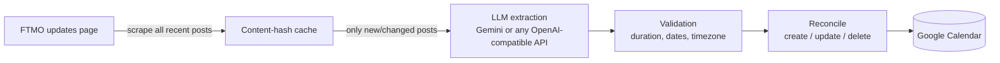

# prop-firm-calendar

> Never get caught by a prop firm's maintenance window or early close again.

[](https://github.com/Bogzx/prop-firm-calendar/actions/workflows/ci.yml)
[](https://github.com/Bogzx/prop-firm-calendar/releases)


[](https://calendar.bogdantruta.com)

## ⚡ Use it right now — no install

A public instance runs at **[calendar.bogdantruta.com](https://calendar.bogdantruta.com)**.
Add the feed to your calendar in 30 seconds:

```
https://calendar.bogdantruta.com/feed.ics
```

**Google Calendar:** Other calendars → **+** → *From URL* → paste →
appears on your phone automatically. ([Apple/Outlook instructions and
per-event-type filters on the live page.](https://calendar.bogdantruta.com))

prop-firm-calendar watches the announcement pages of **FTMO, Topstep, Blueberry
Funded and E8 Markets**, extracts scheduled platform maintenance, market closures and
early closes with an LLM, and publishes them as a subscribable ICS feed (and,
optionally, a Google Calendar) — **including updating or removing events when a firm
reschedules an announcement**. Events come with popup reminders, so you get warned
*before* the platform goes down, not after.

*Renamed in 0.9.0 from `ftmo-calendar` / AutoFtmoCalendar: the Python package is now
`prop_firm_calendar` and the command `prop-firm-calendar`. The old command and import
name still work as aliases.*

## Two ways to use it

| Role | What you do | What you need |
| --- | --- | --- |
| **Subscriber** (most people) | Paste a hosted feed URL into Google/Apple/Outlook calendar — done in 30 seconds | Nothing. No accounts, no API keys, no install |
| **Host** (one person per group) | Run one Docker container on any VPS; it scrapes, parses, and publishes the feed for everyone | An LLM API key. Google account optional |

### Subscribe to a hosted feed (30 seconds)

Use the public instance above, or any feed someone hosts for your group:

- **Google Calendar:** Other calendars → **+** → *From URL* → paste `https://<host>/feed.ics`
- **Apple Calendar:** File → *New Calendar Subscription…* → paste the URL
- **Outlook:** Add calendar → *Subscribe from web* → paste the URL

Your calendar app re-polls the feed automatically; the feed itself carries a
refresh hint matching the host's sync interval.

### Host a feed on your VPS (5 minutes)

Feed-only mode needs **no Google account at all** — one LLM key and one container:

```bash
git clone https://github.com/Bogzx/prop-firm-calendar && cd prop-firm-calendar
mkdir data && sudo chown -R 1000:1000 data   # the container runs as uid 1000
printf '[calendar]\nenabled = false\n' > data/config.toml
cp .env.example .env          # put your LLM_API_KEY in it
docker compose up -d
```

That's it. Your group subscribes to `http://your-vps:8080/feed.ics`, and
`http://your-vps:8080/status` is a shareable page with the next event and
subscribe instructions. Set `PORT=9000` in `.env` if 8080 is taken. A failing
sync never takes the feed down — the last good data keeps serving and you get a
notification (see below).

`/healthz` is built for an uptime monitor: it returns **503**, not 200, when the
last sync failed, when no successful sync has landed within twice the sync
interval, or when a run finished but produced a suspicious result. Point
UptimeRobot at it and a silently frozen calendar pages you.


For public hosting, put it behind a reverse proxy with HTTPS (Caddy/nginx) —
the container itself serves plain HTTP. A complete VPS walkthrough (Cloudflare
DNS, Docker, Caddy with automatic HTTPS) is in
[docs/DEPLOYMENT.md](docs/DEPLOYMENT.md).

## How it works



- **Trustworthy sync.** Every created event carries a stable reconcile key. When an
  announcement changes, stale future events are removed and replaced; events that
  already happened are preserved as history. A lost state file does not cause
  duplicates — events are rediscovered in the calendar by key.
- **Cheap.** Post contents are hashed; unchanged posts cost zero LLM calls.
- **Deterministic.** Temperature-0 extraction with a strict JSON schema, a repair
  retry, model fallback, and sanity validation (end after start, duration caps,
  plausible date window, timezone taken from the announcement's stated offset).
- **Fails loudly — including when nothing raised.** A broken scraper or expired
  token exits non-zero with clear instructions. So do the quiet failures, which
  are the dangerous ones: if the keyword gate stops matching any post (FTMO
  reworded, or the page moved), or a post that had events suddenly extracts
  none, or validation rejects an event the announcement contains (a row with no
  stated offset for a firm that requires one, a garbled time, an over-long
  window), the run reports an *anomaly* — non-zero exit, a notification, a 503
  on `/healthz`, and a badge on the status page. It never silently does nothing
  while you trust an empty calendar.
- **Far-future events are held, not dropped.** Anything beyond
  `max_days_ahead` is kept in the state and published once it comes within
  range, with no further LLM call.
- **Refuses to delete on doubt.** If an announcement's extraction loses events
  with nothing new to replace them — collapsing to zero, or shrinking from 8
  events to 1 — the missing future events are kept and flagged, not removed. A
  degraded extraction and a withdrawn announcement look identical, and only one
  of them is recoverable for someone who planned around the window. (A genuine
  reschedule announces *new* times and reconciles normally.)
- **One entry per window.** When a firm re-announces a window in a follow-up
  post, both posts share one calendar entry; it is removed only when the last
  post announcing it withdraws it.
- **Never guesses at content.** Scraper selectors are class-anchored per source;
  structural drift raises instead of feeding the LLM whatever element happened
  to match, which is how a redesign turns into confident, wrong calendar entries.

## Quickstart

```bash
git clone https://github.com/Bogzx/prop-firm-calendar
cd prop-firm-calendar
python -m venv .venv && . .venv/bin/activate    # Windows: .venv\Scripts\activate
pip install -e .

cp .env.example .env                # add your LLM API key
cp config.example.toml config.toml  # optional: tweak settings

prop-firm-calendar auth                  # one-time Google authorization (opens a browser)
prop-firm-calendar run --dry-run         # see what it would do
prop-firm-calendar run                   # sync for real
```

## Choosing an LLM provider

Any API key works — pick whichever provider you already have.

**Gemini (default).** Free tier available. Get a key at
[aistudio.google.com/apikey](https://aistudio.google.com/apikey) and put it in `.env`
as `LLM_API_KEY`.

**OpenRouter / OpenAI / Groq / Ollama / anything OpenAI-compatible:**

```toml
# config.toml — example: DeepSeek via OpenRouter
[llm]
provider = "openai-compatible"
base_url = "https://openrouter.ai/api/v1"   # or your provider's endpoint
models = ["deepseek/deepseek-v4-flash", "deepseek/deepseek-v4-pro"]
```

Set `LLM_API_KEY` in `.env` to your [OpenRouter key](https://openrouter.ai/keys).
Any model on the platform works — `deepseek/deepseek-chat`, `openai/gpt-5-mini`,
`google/gemini-2.5-flash`, … The extractor is robust to model quirks: it strips
reasoning `<think>` blocks (DeepSeek R1 etc.), markdown fences, and prose around
the JSON, and retries with the validation error before falling back to the next
model in `models`.

## Google Calendar setup

### Option A: OAuth (desktop machines)

1. Follow Google's [Calendar API quickstart](https://developers.google.com/workspace/calendar/api/quickstart/python)
   to create a **Desktop app** OAuth client; download `credentials.json` into the
   project directory.
2. **Important — publish your app to Production.** In Google Cloud console →
   *APIs & Services → OAuth consent screen*, click **Publish app**. Apps left in
   *Testing* status get refresh tokens that **expire every 7 days**, which is the
   usual cause of "it keeps asking me to log in". Publishing for personal use does
   not require verification (you'll just see an "unverified app" warning once).
3. Run `prop-firm-calendar auth`. A browser opens; grant access. The token is saved to
   `token.json` and auto-refreshes from then on.
4. `prop-firm-calendar auth --check` shows token health at any time.

The calendar named in `config.toml` (`Trading` by default) is found or created
automatically.

### Option B: Service account (servers — recommended for cron)

No browser, no token, **nothing ever expires**:

1. In Google Cloud console, create a **service account** and download its JSON key
   as `service_account.json` in the project directory.
2. In [Google Calendar](https://calendar.google.com), create (or pick) a calendar →
   *Settings and sharing* → *Share with specific people* → add the service account's
   email with **Make changes to events**.
3. Copy the calendar's **Calendar ID** (Settings → *Integrate calendar*) into config:

```toml
[calendar]
auth_mode = "service_account"
calendar_id = "xxxxxxxxxxxx@group.calendar.google.com"
```

## Notifications

Get pinged when something changes — or when something breaks. Add a channel to
`.env` and it activates automatically:

```bash
DISCORD_WEBHOOK_URL="https://discord.com/api/webhooks/..."   # and/or:
TELEGRAM_BOT_TOKEN="123456:ABC..."
TELEGRAM_CHAT_ID="123456789"
WEBHOOK_URL="https://hooks.example.com/services/..."         # generic JSON POST
```

You'll receive messages like:

```
📅 Trading calendar updated
➕ ⚠️ Platform Maintenance — Sat 06 Jun 08:00–14:00 +03

⚠️ prop-firm-calendar ran but the result looks wrong:
• keyword gate matched none of 4 scraped post(s) — the announcement wording
  or the page structure may have changed

❌ prop-firm-calendar run failed: OAuth token refresh failed (expired or revoked). ...
```

This is the push that an ICS feed cannot give you: a subscriber's calendar app
polls on its own schedule, but a webhook fires the moment a window is
announced. `WEBHOOK_URL` accepts anything that takes a JSON POST — Slack and
Mattermost incoming webhooks work as-is on the `text` field, and receivers that
want structure get the events too:

```json
{
  "kind": "events",
  "text": "📅 Trading calendar updated\n➕ ⚠️ Platform Maintenance — …",
  "created": ["⚠️ Platform Maintenance — Sat 06 Jun 08:00–14:00 +03"],
  "removed": [],
  "anomalies": []
}
```

Set `heartbeat_hours = 24` under `[notify]` in `config.toml` for a daily
"✅ alive" ping — so silence always means something is wrong, never that the
tool quietly died.

## ICS feed details

Set `[ics] enabled = true` (forced on automatically in feed-only and serve
modes) and every run writes `ftmo-events.ics`: stable UIDs per event, local
times in `[calendar] timezone` with a matching `VTIMEZONE`, popup alarms
matching `reminders_minutes`, a `REFRESH-INTERVAL` hint for subscribers, and a
link to the event's own announcement in its description.

`prop-firm-calendar serve` exposes it over HTTP alongside operations endpoints:

- `GET /feed.ics` — the calendar feed (add it as "subscribe by URL")
- `GET /status` — shareable page: next event, sync health, age of the last
  successful sync, subscribe how-to
- `GET /api/v1/…` — read-only JSON API ([below](#json-api))
- `GET /healthz` — JSON with `ok`, `status`, `last_run`, `last_success`,
  `last_success_age_seconds`, `stale`, `next_run`, `last_error`, `anomalies`,
  plus `sources` (per-firm health, including `events_upcoming`,
  `events_deferred` and `rejected_extractions` — what each firm's calendar
  holds and what validation kept out of it) and `unhealthy_sources`.
  **HTTP 503 when not `ok`**, so a plain uptime monitor detects a broken sync.

**Per-firm health.** With several firms configured, each carries its own
freshness, errors and staleness verdict under `sources`, and **any** unhealthy
firm makes the overall `ok` false (`status: "degraded"`). A source that has
quietly stopped publishing must be visible on its own — averaged into an
overall green, it stays unnoticed until someone gets caught by an outage. The
`/status` page grows a SOURCES panel showing the same thing.

One firm failing never stops the others: each is fetched, extracted and
reconciled independently, so a redesigned page at one firm cannot freeze
everyone else's calendar. Only if *every* firm fails does the run itself fail.

Serve mode keeps the feed available from the moment it starts (last good data,
even if the newest sync attempt fails) and notifies a given error only once —
not every interval — until it changes or resolves.

**Per-interest feeds:** subscribers who only care about some event types can
filter with a query parameter — each distinct URL behaves as its own calendar:

```
/feed.ics                                   # everything
/feed.ics?types=crypto_closure              # crypto closures only
/feed.ics?types=early_close,holiday_closure # any combination
```

**Per-firm feeds:** the same applies to firms, and the two filters combine —
so a trader funded at one firm subscribes to just that firm:

```
/feed.ics?firms=ftmo                        # one firm
/feed.ics?firms=ftmo,topstep                # several
/feed.ics?firms=topstep&types=early_close   # firm and type together
```

`/feed.ics` with no parameters keeps returning everything, exactly as it always
has — the URL people are already subscribed to does not change meaning. An
unknown firm returns a 400 listing the configured ones.

| Type | Example event title |
| --- | --- |
| `maintenance` | ⚠️ Platform Maintenance — cTrader |
| `crypto_closure` | 🚫 Crypto Closed |
| `holiday_closure` | 🏖️ Closed All Day — UK100.cash, HK50.cash, Equities I CFD |
| `early_close` | ⏳ Early Close — US30.cash, US100.cash, US500.cash |
| `late_open` | 🕗 Late Open — CORN.c, SOYBEAN.c, WHEAT.c |
| `symbol_event` | 📌 Forced Action — FDX |
| `other` | ℹ️ FTMO Trading Update |

Event titles carry the affected symbols, extracted from the announcement. The
landing page has checkboxes that build the URL for you; unknown types return
a 400 listing the valid ones.

## JSON API

`serve` mode also answers read-only JSON, so bots, order routers and dashboards
can ask "is it safe to trade right now?" without parsing ICS. It is the same
state and the same de-duplication as the feed (on the public instance from 0.9.0):

```bash
curl -s 'https://calendar.bogdantruta.com/api/v1/next'
curl -s 'https://calendar.bogdantruta.com/api/v1/events?firm=topstep&type=early_close,holiday_closure&from=2026-11-01&to=2027-01-31'
```

| Endpoint | Returns |
| --- | --- |
| `GET /api/v1/` | endpoints, configured firms (`firm`, `firm_name`) and event types |
| `GET /api/v1/events` | windows overlapping `[from, to)`, sorted by start |
| `GET /api/v1/next` | per configured firm: the window in progress, else the next one — `next: null` when nothing is scheduled |

Parameters (all optional): `firm` and `type` take comma-separated values
(unknown ones are a `400` listing the valid values); `from` and `to` take an ISO
date (`2026-12-24`, midnight UTC) or timestamp (`2026-12-24T15:00:00Z`; no
offset means UTC). `from` defaults to *now*, so a bare `/api/v1/events` is
"what is live or coming up"; pass an earlier `from` for recent history (the
state keeps about 45 days). `next` honours `firm` and `type`.

Each event:

```json
{
  "id": "4560b9cb2193c0f3",
  "firm": "topstep", "firm_name": "Topstep",
  "type": "early_close", "summary": "⏳ Early Close — Thanksgiving",
  "start": "2026-11-26T11:45:00-06:00", "end": "2026-11-26T23:59:00-06:00",
  "start_utc": "2026-11-26T17:45:00+00:00", "end_utc": "2026-11-27T05:59:00+00:00",
  "status": "upcoming",
  "source_url": "https://help.topstep.com/en/articles/13350348-topstep-holiday-trading-hours"
}
```

`status` is `upcoming`, `live` or `past` at `generated_at`; `start`/`end` are in
the offset the calendar stores, `*_utc` are the same instants in UTC. `id` is
the event's stable identity (the ICS `UID` prefix). Where the extraction quoted
its source, `evidence` carries that quote.

Responses carry `Access-Control-Allow-Origin: *` (callable from any web page;
no cookies are read or set), `Cache-Control: public, max-age=300`, and an
`ETag` — send it back as `If-None-Match` for a `304`. The API is versioned in
the path; fields may be added to `v1`, never removed or renamed.

## Built-in statistics

Serve mode keeps simple, self-hosted usage stats: page views, unique visitors
(an anonymous first-party cookie with a random id — no third parties, nothing
identifiable), feed pulls, and unique feed clients. Today's numbers appear in
the page footer; `GET /stats` returns JSON with a 30-day daily history
(persisted in `stats.json`).

## Tracking several prop firms

List them; order does not matter.

```toml
[[firms]]
profile = "ftmo"

[[firms]]
profile = "topstep"

[[firms]]
profile = "blueberry-funded"
```

Omit `[[firms]]` entirely and the `[source]` section is used as the single
firm — which is what every configuration written before this feature does, and
it keeps behaving identically.

### Firms shipped

Each was verified against the live site: a recorded fixture, a hand-checked
extraction, a golden test pinning the real announcement to its event set, and
a timezone established from the firm's own words rather than assumed.

| Profile | Firm | What it publishes | Timezone |
| --- | --- | --- | --- |
| `ftmo` | FTMO | daily trading updates | fixed GMT+3 (`Etc/GMT-3`) — stated as "MetaTrader platform time" |
| `topstep` | Topstep | full-year CME holiday table | `America/Chicago` — stated as "CT", observes DST |
| `blueberry-funded` | Blueberry Funded | recurring crypto maintenance | `Europe/London` — stated as "BST" (with an EDT column that corroborates it) |
| `e8-markets` | E8 Markets | monthly holiday schedule | **no fallback zone**; the offset is read from each row |

E8 is the interesting case. Their own help centre says the server moves to
UTC+2 "at the beginning of November" and UTC+3 "at the end of March" — a rule
that matches no IANA zone (Europe/Athens reverts a week earlier; a fixed offset
never moves). Rather than pick which week to be wrong in, that profile sets
`require_stated_offset`: every row of their schedule carries its own `(gmt+3)`,
so the announcement's offset is used and a row without one is **rejected**
rather than published at a guessed hour.

### Adding another firm

A source is a TOML file, not a Python module. Copy
[`src/prop_firm_calendar/sources/profiles/example-firm.toml`](src/prop_firm_calendar/sources/profiles/example-firm.toml),
fill in the page's selectors, and record a fixture:

```bash
python scripts/record_fixtures.py --profile fundednext --posts 2
```

That records real pages into `tests/fixtures/<profile>/` so the parse tests run
offline against markup the site actually served.

The profile carries the index URL, the CSS selectors for the announcement body
on index and detail pages, any sub-elements to strip out of it, the link
pattern for older posts, the firm's timezone, its keyword gate, and free-text
prompt hints (house vocabulary, the boilerplate the model should ignore).
Everything else — fetching, retries, date parsing, post identity, extraction,
consensus, validation, reconcile, the feed — is already firm-agnostic.

Two things are worth getting right before you ship one:

- **The timezone.** Find out what the firm actually states, and whether it is a
  fixed offset or a DST-observing zone. Wrong times are worse than no times.
  If the firm's clock follows no IANA zone, set `require_stated_offset = true`
  and let the announcement supply the offset.
- **The post key prefix.** Post keys share one namespace across firms, so give
  each profile its own `post_key_prefix` and keep it stable once deployed.

## Scraping politely

The project now fetches from several unrelated companies on a schedule, so it
behaves like something you would not mind having in your access log:

- **An honest User-Agent** — `…(compatible; TradingCalendarBot/1.0;
  +https://github.com/Bogzx/prop-firm-calendar)`. No browser impersonation, so an
  operator who wants it to stop can find out who it is and say so.
- **robots.txt is fetched, cached per host, and obeyed.** A disallowed URL is
  refused outright with a clear error rather than quietly skipped. Rules naming
  `TradingCalendarBot` specifically are honoured too. An *unreachable* robots.txt
  fails open — someone else's 500 is not consent withheld, and treating it as a
  ban would silently empty subscribers' calendars.
- **`Crawl-delay` is honoured** (capped at 30s, beyond which it is a decision
  for a human rather than a sleep in the sync loop).
- **A per-host floor between requests**, shared process-wide, so two profiles on
  one host still look like one client.
- **Staggered starts**, so N firms sharing a sync interval do not all fire on
  the same second of it.

All of it is tunable under `[scrape]`.

## Scheduling

Exit codes: `0` success, `1` runtime error (including a run that completed but
reported an anomaly), `2` configuration/auth error — so your scheduler can alert
you on failure.

**Linux (cron), every 6 hours:**

```cron
0 */6 * * * cd /opt/prop-firm-calendar && .venv/bin/prop-firm-calendar run >> cron.log 2>&1
```

**Windows (Task Scheduler):**

```powershell
schtasks /Create /TN "Prop Firm Calendar" /SC HOURLY /MO 6 `
  /TR "C:\path\to\prop-firm-calendar\.venv\Scripts\prop-firm-calendar.exe --config C:\path\to\prop-firm-calendar\config.toml run"
```

## CLI reference

| Command | What it does |
| --- | --- |
| `prop-firm-calendar run` | Scrape, extract, and sync the calendar (default command) |
| `prop-firm-calendar run --dry-run` | Print planned creates/updates/deletes; touch nothing |
| `prop-firm-calendar auth` | One-time interactive Google authorization (OAuth mode) |
| `prop-firm-calendar auth --check` | Report credential/token health |
| `prop-firm-calendar status` | Show tracked posts and the events created for them |
| `prop-firm-calendar serve [--port N]` | Periodic sync + hosted ICS feed and status page |
| `--config PATH` | Use a config file other than `./config.toml` |
| `-v` | Debug logging |

## Troubleshooting

- **"Token refresh failed" every week** → your OAuth app is in *Testing* status.
  Publish it to Production (see setup above), then `prop-firm-calendar auth` once more.
  Or switch to a service account and never think about tokens again.
- **"No trading-update posts found"** → FTMO changed their page structure. Please
  [open an issue](https://github.com/Bogzx/prop-firm-calendar/issues).
- **LLM quota errors** → add more fallback `models`, or point `provider`/`base_url`
  at a different (or local) provider.
- **Wrong event times** → FTMO states times in GMT+3 (MetaTrader platform time, a
  *fixed* offset), and the extractor uses the offset stated in each announcement.
  `[source] timezone` is the fallback when an announcement omits one; it defaults
  to `Etc/GMT-3`. Do not set it to a DST-observing civil zone such as
  `Europe/Bucharest` — that is GMT+2 from late October to late March and shifts
  every offset-less winter announcement an hour early.
- **`/healthz` returns 503 but nothing looks broken** → check `status` in the
  JSON body: `stale` means no successful sync within two intervals, `anomaly`
  means a run finished but its result is not trustworthy (see `anomalies`).

## Development

```bash
pip install -e .[dev]
pytest          # run tests
ruff check .    # lint
mypy src        # type-check
```

The architecture and roadmap live in [`docs/superpowers/specs/`](docs/superpowers/specs/).

---

*This is a personal project and is not affiliated with FTMO.*
